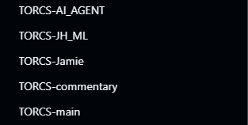

#Reflection on Sprint 1:

Team collaboration broke down, was removed from original team and was put in position to work with another excluded teammate.
Audited all 5 branches left behind: TORCS-commentary, TORCS-Jamie, TORCS-AI_AGENT, TORCS-JH_ML, TORCS-main
Each branch had different features, nothing was merged or working together and different models of IBM Granite were used.
After the other former teammate refused to engage to decided to continue solo and take ownership of the full project

#The plan for the next sprint consisted of the following: 

Merge the best parts of each branch into one integrated branch to communicate a completed product
Standardise on Ollama for all AI features so they use a universal model
Deliver working features by Sprint 2

#Here were some compromises faced when dealt with this:

Split LLM approach as some branches used Ollamma and some used Hugging face

